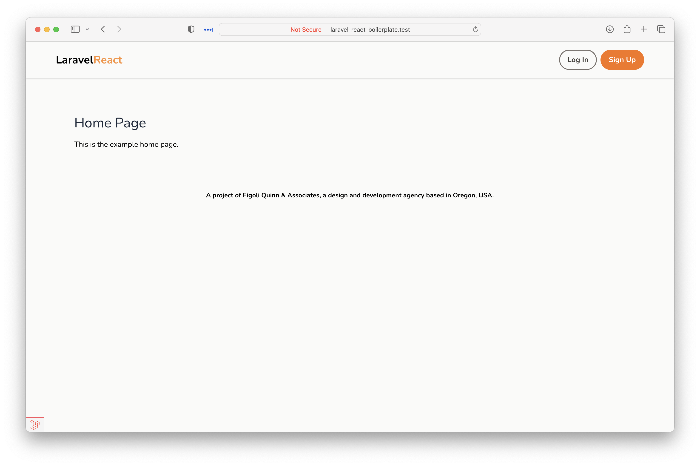

## About Laravel React Boilerplate

Welcome! This project was created as a boilerplate / app starter kit for getting up and running with Laravel + ReactJS. I love using React and Laravel, but the resources out in the wild tend to be focused on VueJS, or an integration of something like LiveWire or Inertia. I wanted to create a boilerplate that was focused on ReactJS, and that was easy to get up and running with.

### Features

- Laravel 9
- ReactJS 18
- Laravel Sanctum (SPA authentication)
- PHP Pest (testing library)
- TailwindCSS 3
- User authentication, signup, email verification ready to go out of the box
- Includes some basic ReactJS components to get you started

### Installation

You'll need to have a local development environment already setup. There's lots of ways to do this but I recommend using [Laravel Valet](https://laravel.com/docs/9.x/valet) or [Laravel Sail](https://laravel.com/docs/9.x/installation#laravel-and-docker).

Once you've got that squared away, follow the steps below to get setup.

1. Clone the repo with `git clone git@github.com:figoli-quinn/laravel-react-boilerplate`
2. Run `composer install` to install the PHP dependencies
3. Run `npm install` to install the JS dependencies
4. Copy the `.env.example` file to `.env`. Inside this new ENV file, you'll need to make sure to update the following settings:

- `APP_URL` - This should be the URL of your local development environment. If you're using Laravel Valet, this will be something like `http://laravel-react-boilerplate.test`
- `VITE_APP_URL` - This should match the `APP_URL` setting above` and allows the vite bundler, and through that, ReactJS to access the url of the site.
- `DB_DATABASE` - This should be the name of the database you want to use for the project.
- `DB_USERNAME` - This should be the username of the database user you want to use for the project.
- `DB_PASSWORD` - This should be the password of the database user you want to use for the project.
- `SESSION_DOMAIN` - This should match the domain of the environment you're using this on and allows the Sanctum cookies to work properly.
- `SANCTUM_STATEFUL_DOMAINS` - This should match the domain of the environment you're using this on and allows the Sanctum cookies to work properly.

5. Run `php artisan migrate:fresh` to run the database migrations
6. Run `npm run build` to build the JS and CSS assets.
7. Hopefully success! Try visiting the site in your web browser. You should see the homepage.

### Developing your app

This boilerplate is intended to be used once to get you started quickly, and then you're off on your own developing you app. This is not intended to be something you have to come back to and update any time this project has an update. 

One thing to note when developing if you're not familiar with using Vite with Laravel, you can run `npm run dev` to have Vite watch for changes and rebuild the JS and CSS assets as you make changes. This will also hot-reload the page in your browser. However, if you stop the dev process, you'll notice your files will look like they've reverted when viewing the site in the browser. To make your changes permanent, you'll need to run `npm run build` to rebuild the assets.

### Support

If you have any questions or issues, please feel free to open an issue on the repo. I'll do my best to help out.

Laravel is a web application framework with expressive, elegant syntax. We believe development must be an enjoyable and creative experience to be truly fulfilling. Laravel takes the pain out of development by easing common tasks used in many web projects, such as:

- [Simple, fast routing engine](https://laravel.com/docs/routing).
- [Powerful dependency injection container](https://laravel.com/docs/container).
- Multiple back-ends for [session](https://laravel.com/docs/session) and [cache](https://laravel.com/docs/cache) storage.
- Expressive, intuitive [database ORM](https://laravel.com/docs/eloquent).
- Database agnostic [schema migrations](https://laravel.com/docs/migrations).
- [Robust background job processing](https://laravel.com/docs/queues).
- [Real-time event broadcasting](https://laravel.com/docs/broadcasting).

Laravel is accessible, powerful, and provides tools required for large, robust applications.

## Learning Laravel

Laravel has the most extensive and thorough [documentation](https://laravel.com/docs) and video tutorial library of all modern web application frameworks, making it a breeze to get started with the framework.

You may also try the [Laravel Bootcamp](https://bootcamp.laravel.com), where you will be guided through building a modern Laravel application from scratch.

If you don't feel like reading, [Laracasts](https://laracasts.com) can help. Laracasts contains over 2000 video tutorials on a range of topics including Laravel, modern PHP, unit testing, and JavaScript. Boost your skills by digging into our comprehensive video library.

## Laravel Sponsors

We would like to extend our thanks to the following sponsors for funding Laravel development. If you are interested in becoming a sponsor, please visit the Laravel [Patreon page](https://patreon.com/taylorotwell).

### Premium Partners

- **[Vehikl](https://vehikl.com/)**
- **[Tighten Co.](https://tighten.co)**
- **[Kirschbaum Development Group](https://kirschbaumdevelopment.com)**
- **[64 Robots](https://64robots.com)**
- **[Cubet Techno Labs](https://cubettech.com)**
- **[Cyber-Duck](https://cyber-duck.co.uk)**
- **[Many](https://www.many.co.uk)**
- **[Webdock, Fast VPS Hosting](https://www.webdock.io/en)**
- **[DevSquad](https://devsquad.com)**
- **[Curotec](https://www.curotec.com/services/technologies/laravel/)**
- **[OP.GG](https://op.gg)**
- **[WebReinvent](https://webreinvent.com/?utm_source=laravel&utm_medium=github&utm_campaign=patreon-sponsors)**
- **[Lendio](https://lendio.com)**

## Contributing

Thank you for considering contributing to the Laravel framework! The contribution guide can be found in the [Laravel documentation](https://laravel.com/docs/contributions).

## Code of Conduct

In order to ensure that the Laravel community is welcoming to all, please review and abide by the [Code of Conduct](https://laravel.com/docs/contributions#code-of-conduct).

## Security Vulnerabilities

If you discover a security vulnerability within Laravel, please send an e-mail to Taylor Otwell via [taylor@laravel.com](mailto:taylor@laravel.com). All security vulnerabilities will be promptly addressed.

## License

The Laravel framework is open-sourced software licensed under the [MIT license](https://opensource.org/licenses/MIT).
